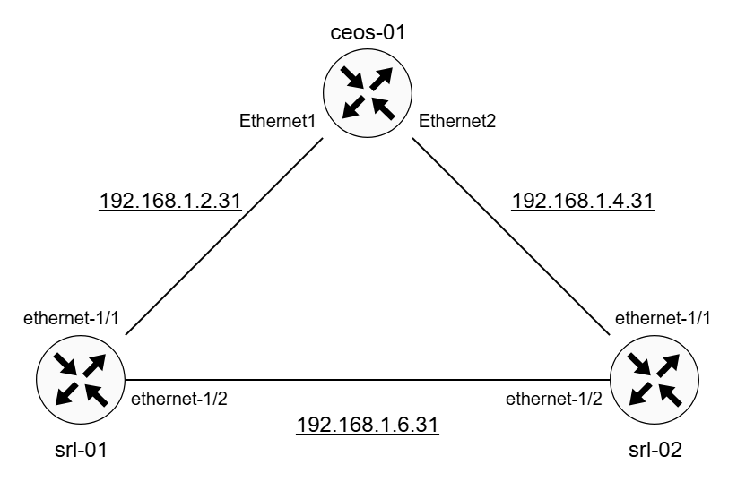

# Network Topology

This tutorial is based on a simple three-node multi-vendor network arranged in a ring topology. The three routers are connected to management network named `api-lab` using the IPv4 subnet `192.168.100.0/24`.

Node | Model | Management IP
:---:|---|---
ceos-01 | Arista cEOS | 192.168.100.11
srl-01  | Nokia SR Linux node | 192.168.100.12
srl-02  | Nokia SR Linux node | 192.168.100.13




## Software Version and Documentation

Node | Version | Documentation
---|---|---
Arista cEOSLab | 4.35.1F | https://www.arista.com/en/support/product-documentation
| | | https://github.com/aristanetworks/yang
Nokia SR Linux | 25.10.1 | https://documentation.nokia.com/srlinux/25-10/ 
| | | https://documentation.nokia.com/srlinux/25-10/html/product/reference.html


## Downloading YANG models

IETF:

```bash
git clone https://github.com/YangModels/yang ietf
```

OpenConfig

```bash
git clone https://github.com/openconfig/public/ openconfig
```


Arista cEOS:

```bash
git clone https://github.com/aristanetworks/yang/tree/master/EOS-4.35.1F arista
```

Nokia SR Linux:

```bash
git clone -b v25.10.1 --depth 1 https://github.com/nokia/srlinux-yang-models nokia
```